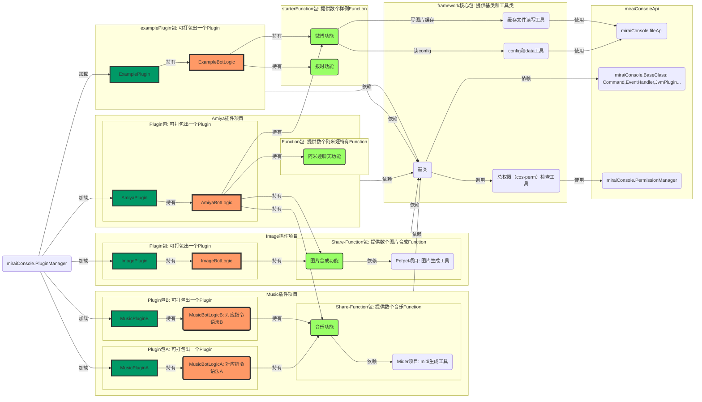

本框架用于尝试一种Plugin内部的分层结构，以获得代码复用等优势。不一定适合刚接触mirai插件开发的人，因为本框架引入了若干新的概念，同时也要求开发者对mirai-console原有的开发所需概念有足够了解。

使用本框架的插件项目：

- [欧根插件(砍口垒助手)](https://github.com/hundun000/mirai-fleet-prinzeugen)
- [阿米娅插件(明日方舟助手)](https://github.com/hundun000/mirai-fleet-amiya)
- [音乐插件](https://github.com/hundun000/mirai-fleet-music)
- [图片合成插件](https://github.com/hundun000/mirai-fleet-image)

## 分层关系

Plugin间复用的对象是Function，即使用对方项目的Share-Function，而不是将对方Plugin作为前置插件。

虽然MusicProject和ImageProject具有打出MusicPlugin和ImagePlugin的能力，但是这些plugin一般只用来验证Share-Function。MusicProject和ImageProject主要目的是提供Share-Function给AmiyaProject和PrinzeugenProject。

### BotLogic

Plugin持有一个对应的BotLogic。保持Plugin只处理和mirai对接工作，需满足继承JvmPlugin等约束。本框架的Function层只接触BotLogic。

BotLogic负责的具体的逻辑包括：

- 定义本Plugin对应的唯一CharacterName和[CharacterCosPermission](https://mirai.mamoe.net/topic/535)。即使用本框架的Plugin的推荐设计思路是：一个Plugin对应某个Character的角色扮演功能集合。（类似市场上智能助手app的拟人化）
- 持有若干Function, （onEnable时）将它们初始化（with CharacterName），并注册为Command/ListenHost。

### Function

负责一类业务功能，由若干子功能组成。子功能的被调用形式有：

- 子功能被调用于一个被@SubCommand注解的方法，且包在一个CompositeCommand里（见CompositeCommandFunctionComponent），等待被注册。
- 子功能被调用于一个被@EventHandler注解的方法，等待被注册。
- 子功能被调用于一个Timer，等待被启用。

实际使用时，还有如下技巧：

- 同一个子功能的被调用形式可以不止一种，也就是说可以既写一个被@SubCommand注解的方法调用该子功能，又写一个@EventHandler注解的方法调用该子功能。[需求来源](https://mirai.mamoe.net/topic/848/%E6%9C%89%E6%B2%A1%E6%9C%89%E4%BB%80%E4%B9%88%E5%8A%9E%E6%B3%95%E8%87%AA%E5%AE%9A%E4%B9%89%E6%8F%92%E4%BB%B6%E5%9B%9E%E5%A4%8D%E7%9A%84%E8%A7%A6%E5%8F%91%E8%AF%AD%E5%8F%A5%E5%91%A2/3)
- 在Function外自定义一个CompositeCommand（见AllCompositeCommandProxy），然后通过点运算调用的方式，调用子功能。[需求来源](https://github.com/mamoe/mirai/issues/1804)

对于开发者，Function即是实现了跨插件复用业务功能。同时，也允许具体Plugin自定义实际注册Command时的指令语法（见AllCompositeCommandProxy）。

## 发展历史

来自[ZacaFleetBot](https://github.com/hundun000/ZacaFleetBot)项目的拆分方案。故框架的大部分来自原项目。

- 原本数个Character共享ZacaFleetBot的core包，拆分后是数个插件项目依赖本项目的core包。
- 试着采用社区建议，不再依赖Spring和MongoDB。